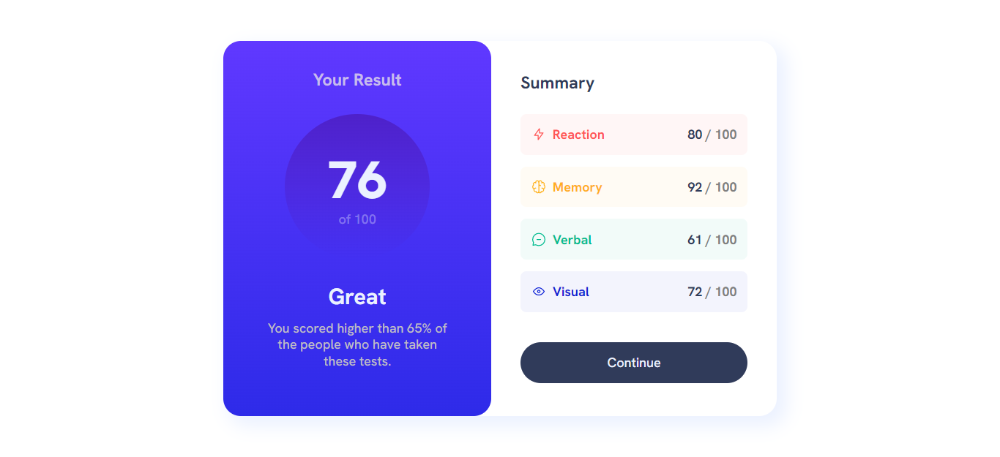
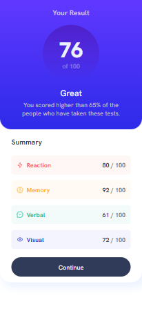

# Frontend Mentor - Results summary component solution

This is a solution to the [Results summary component challenge on Frontend Mentor](https://www.frontendmentor.io/challenges/results-summary-component-CE_K6s0maV). Frontend Mentor challenges help you improve your coding skills by building realistic projects. 

## Table of contents

  - [The challenge](#the-challenge)
  - [Screenshot](#screenshot)
  - [Links](#links)
- [My process](#my-process)
  - [Built with](#built-with)
  - [What I learned](#what-i-learned)
  - [Continued development](#continued-development)
- [Author](#author)

### The challenge

Users should be able to:

- View the optimal layout for the interface depending on their device's screen size
- See hover and focus states for all interactive elements on the page

### Screenshot

### Links

- Solution URL: [Github](https://github.com/floatingPebble/floatingPebble.results-summary-component-FM.io)

## My process

- HTML Layout
- Local CSS variables
- General CSS
- Added local json data to HTML with JavaScript
- Mobile CSS
- Desktop CSS

### Built with

- Semantic HTML5 markup
- CSS custom properties
- Flexbox
- CSS Flex
- Mobile-first workflow
- Vanilla JavaScript

### What I learned

Improved my knowledge on responsive designs and mobile first aproach.

### Continued development

Random challenges from frontendmentor.io since I am trying to replicate real job workflow.

- Website - [floatingPebble](https://github.com/floatingPebble)
- Frontend Mentor - [@floatingPebble](https://www.frontendmentor.io/profile/floatingPebble)
- Twitter - [@ShyToadGames](https://twitter.com/ShyToadGames)